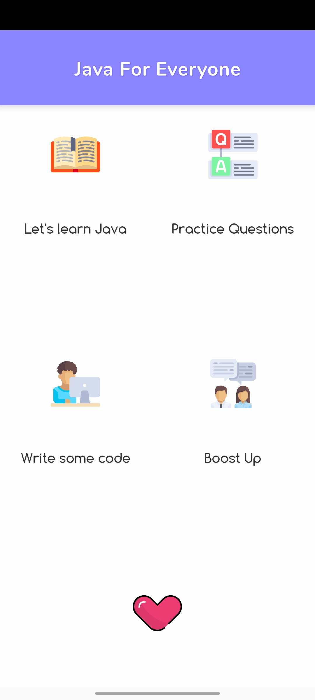
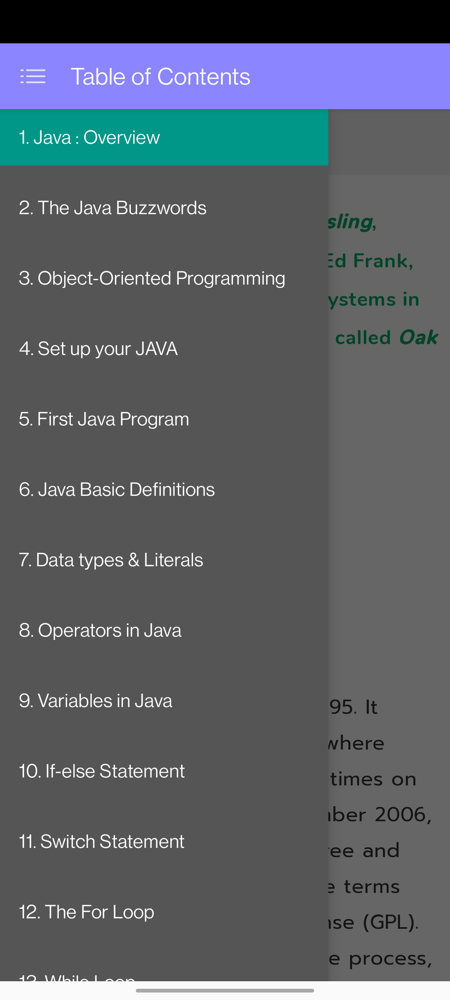
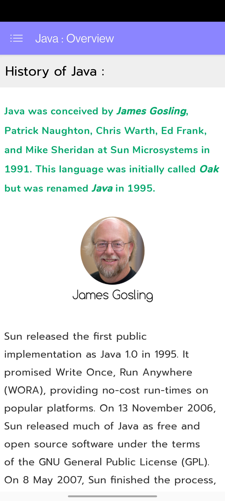
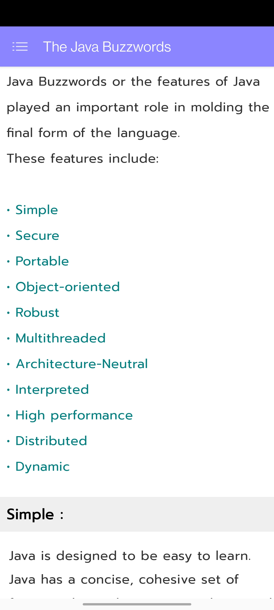
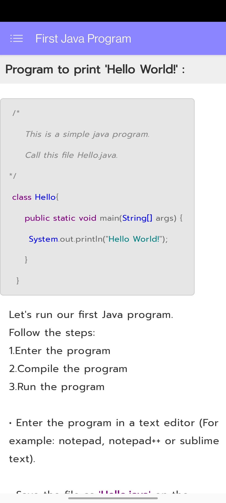
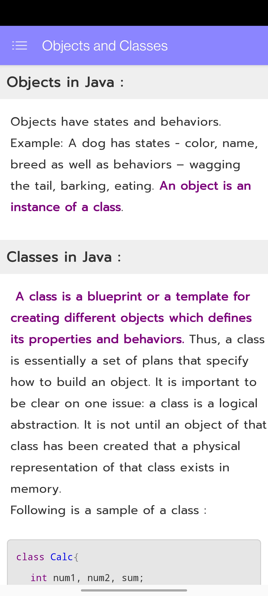
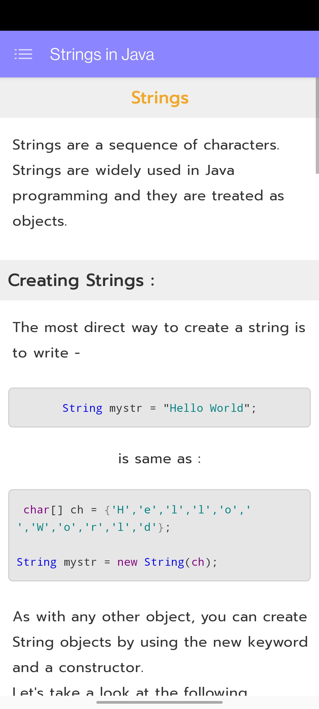
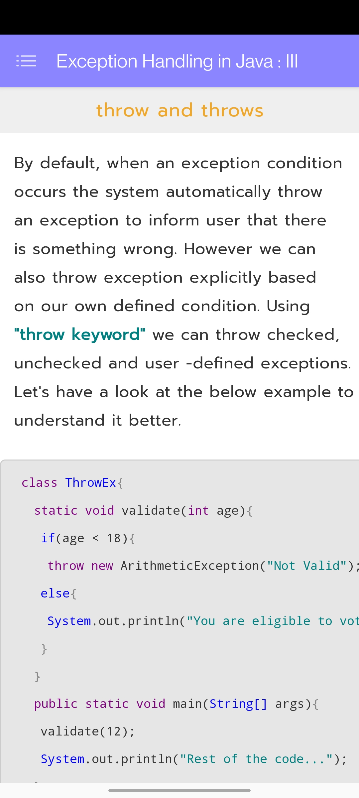
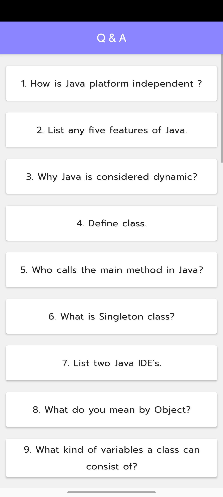
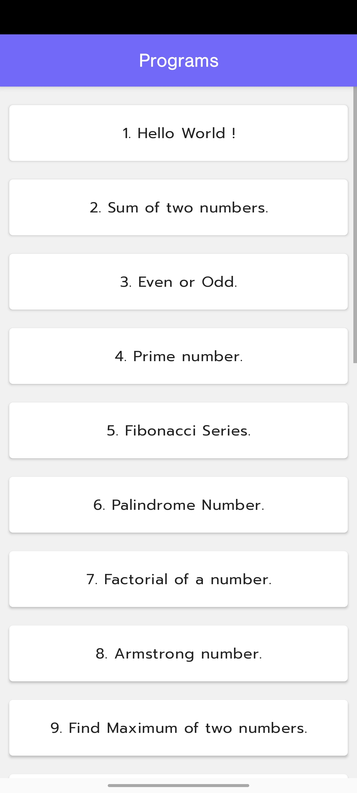

# JavaForEveryone
This is the Java tutorial app that I created during my college. The aim of this application is to teach everyone java and the basics of coding. This application contains some extra stuff as Exam questions and answers and a motivation page.

---

### Screenshots

---

---

---

---

---

---

---

---

---

---

---

---

---

---

---

---

---
